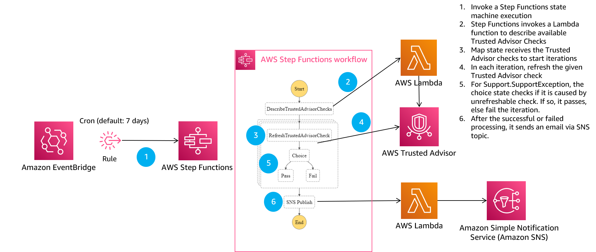
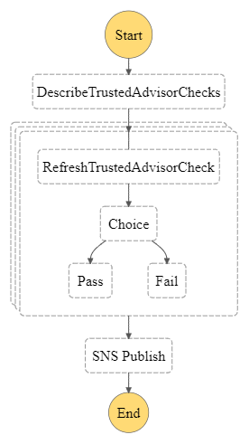
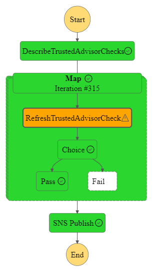
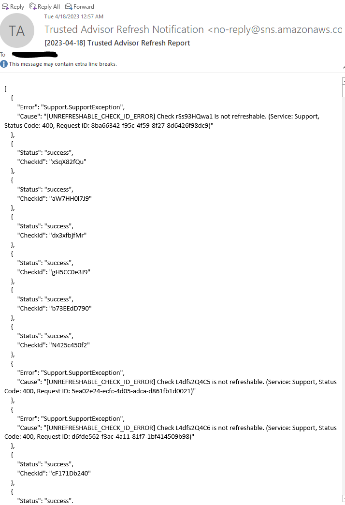

# Trusted Advisor Scheduled Refresh

## Description

If you have a Business, Enterprise On-Ramp, or Enterprise Support plan, Trusted Advisor (TA) automatically refreshes the checks in your account on a weekly basis. 

However, there are few exceptions. If you would like to refresh checks in **GovCloud**, it is a manual process. **Developer and basic support** customers also need to refresh them manually. 

This solution deploys an EventBridge rule to invoke a Step Functions workflow that calls DescribeTrustedAdvisorChecks and RefreshTrustedAdvisorChecks APIs to automate the process. At the end of the workflow, it sends an SNS notification for the list of TA checks for successful invocations. For failed invocations, it sends a message with an error message. 

## Architecture

## Step Functions Workflow

## Deployment
### Prerequisites
- AWS Support plan (Developer, Business, Enterprise On-Ramp, Enterprise)
- AWS credentials

#### Steps
- Download [the CloudFormation template](TrustedAdvisorCFN.yml) or clone this repository (`git clone https://github.com/aws-samples/aws-trusted-advisor-scheduled-refresh.git`)
- Go to CloudFormation console
- Use the template (TrustedAdvisorAutoScheduledRefreshCFN.yml) to create a stack which deploys:
  - AWS::IAM::Role (EventBridge, Lambda, and state machine IAM roles)
  - AWS::Events::Rule
  - AWS::SNS::Topic
  - AWS::SNS::Subscription
  - AWS::StepFunctions::StateMachine
  - AWS::Lambda::Function
- Following the successful deployment of the stack, you will receive an email from SNS about email subscription confirmation. Confirm the subscription in order to start receiving emails for Trusted Advisor refresh notifications. 

## Test

If you would like to test the solution without waiting for 7 days, you can go to Step Functions console and invoke the workflow manually. Following the successful execution, you find a workflow graph as following.

For successful executions, you receive an email from SNS as following:

## Troubleshooting

### RefreshTrustedAdvisorCheck state is showing a warning sign
If you see a warning for the RefreshTrustedAdvisorCheck state, click on the state on the Step Functions state machine execution page. If you find the warning coming from the error `Support.SupportException` with the cause `[UNREFRESHABLE_CHECK_ID_ERROR]`, you can discard the error. There are Trusted Advisor checks that cannot be refreshed. Therefore, it is an expected behavior.